# Workflow 內容持續擴大

**本文彙整 Claude.ai 回應內容。**

## Workflow 單一檔案

在 AI 驅動的自動化浪潮下，許多團隊遵循「需求驅動擴張」的慣性——自動化需求一出現，就直接在現有 Workflow 上堆疊新節點、新分支、新提示鏈。這種模式有其強烈的短期誘因，但同時也埋下系統性風險。

### 優點（Advantages）

##### 1、效率與生產力的複利效應

多步驟工作流將複雜任務拆解為可驗證的子步驟。J.P. Morgan AI Research 在 2023 年 11 月測試的 FlowMind 工作流，針對跨多個基金進行數據彙整的複雜財務問答，準確率達 89.5%，而單一提示基線僅有 8.5%。 [`M Accelerator`](https://maccelerator.la/en/blog/entrepreneurship/flow-engineer-role-prompt-engineering-ai-automation/) 這說明擴展工作流在精確度上能帶來非線性的提升。

投入良好提示工程的企業，在特定工作流中可看到 60–70% 的效率提升、減少反覆修改的週期，並且第一次輸出就符合業務需求。 [`Medium`](https://aloaguilar20.medium.com/the-complete-prompt-engineering-guide-for-2025-mastering-cutting-edge-techniques-dfe0591b1d31)

##### 2、可重用性與標準化

結構化提示讓 AI 代理在 Knack 等平台上更可靠地執行任務，降低錯誤並減少浪費的運算週期，讓企業能更有信心地擴展 AI 驅動的流程。 [`Knack`](https://www.knack.com/blog/why-is-prompt-engineering-important/)

##### 3、跨部門整合能力

Flow Engineer 的核心職責之一是確保 AI 工作流與業務運營無縫整合，包括協調 API 以連接 AI 模型與 CRM、資料庫及通訊平台。 [`M Accelerator`](https://maccelerator.la/en/blog/entrepreneurship/flow-engineer-role-prompt-engineering-ai-automation/) Workflow 擴張讓團隊能橫跨多個系統打通數據流。

##### 4、適應「System 2」思維

單一提示依賴「System 1」思維——快速、自動、基於 token 的決策，對簡單任務有效，但遇到複雜問題會失敗。 [`M Accelerator`](https://maccelerator.la/en/blog/entrepreneurship/flow-engineering-vs-prompt-engineering-complex-tasks/) 擴展後的多步驟工作流能強迫模型採取更審慎的規劃與推理路徑。

##### 5、民主化與無代碼普及

提示工程讓主題專家（行銷、HR、財務等）不需撰寫程式就能使用生成式 AI——只需告訴系統想要什麼，而非編寫程序。 [`IntuitionLabs`](https://intuitionlabs.ai/articles/prompt-engineering-business-guide)

### 缺點（Disadvantages）

##### 1、可靠性的乘法遞減

這是最核心的數學問題。即使 AI 在每個單獨步驟中達到 90% 的準確率，將五個步驟串連起來，整體可靠性也會降低到不足 60%；而由於目前函式呼叫的準確率仍低於 90%，依賴單一提示的解法在生產環境中並不實際。 [`M Accelerator`](https://maccelerator.la/en/blog/entrepreneurship/flow-engineering-vs-prompt-engineering-complex-tasks/)

##### 2、Prompt 脆弱性（Brittleness）

部分開發者試圖用超長提示（有時超過 2000 個 token）來覆蓋所有可能情境，但這些提示往往變得脆弱、難以維護，且幾乎無法擴展。 [`M Accelerator`](https://maccelerator.la/en/blog/entrepreneurship/flow-engineering-vs-prompt-engineering-complex-tasks/) 工具平台層面，研究顯示 80% 的現成 AI 工具在生產環境中因脆弱性和整合問題而失效；一家使用 Zapier + ChatGPT 的公司遭遇了 40% 的錯誤率。 [`AIQ Labs`](https://aiqlabs.ai/blog/what-jobs-are-most-ai-proof-in-2025)

##### 3、隱性技術債（Hidden Technical Debt）

本地端建立一個 Agent 只需幾分鐘，但當它需要進入生產環境並被整個工程部門使用、面對真實數據和真實後果時，問題就出現了。 [`The New Stack`](https://thenewstack.io/hidden-agentic-technical-debt/) 隨著工作流擴張，版本控制、除錯可觀測性、Prompt Drift（提示漂移）都會成為不可忽視的技術債。

##### 4、工具蔓延與治理缺口（Tool Sprawl）

許多組織最終將 RPA、iPaaS 和 AI 協調工具分別拼湊在一起，結果是工具蔓延與治理頭痛。 [`Domo`](https://www.domo.com/learn/article/ai-workflow-platforms) Workflow 越擴越大，往往跨越多個廠商，造成責任邊界模糊。

##### 5、安全攻擊面的擴大

Agentic AI 的範式大幅擴展了能力，但也大幅放大了攻擊面——涵蓋提示注入、知識庫污染、工具/插件漏洞以及多代理湧現威脅。 [`arxiv`](https://arxiv.org/pdf/2603.22928)

具體案例方面，2025 年中期針對 Microsoft Copilot 的 EchoLeak（CVE-2025-32711）漏洞，攻擊者透過含有工程化提示的電子郵件，觸發 Copilot 在無需用戶互動的情況下自動洩露敏感數據。 [`arXiv`](https://arxiv.org/html/2510.23883v1)

##### 6、組織變革阻力

員工可能因擔心工作被取代或難以適應新工作流而阻礙 AI 的落地，這是 Workflow 自動化實施中常見的障礙。 [`Litslink`](https://litslink.com/blog/ai-workflow-automation-a-complete-guide)

### 優缺點的對照結構圖

  

### 核心工程建議

面對 Workflow 擴張，提示詞工程師應建立以下防護機制：

針對可靠性衰減：每個子步驟需要獨立驗證機制（Validation Gate），在每個階段加入內建檢查點，在錯誤累積前及早發現。 [`M Accelerator`](https://maccelerator.la/en/blog/entrepreneurship/flow-engineer-role-prompt-engineering-ai-automation/)

針對技術債：Schema Drift 是造成自動化中斷的首要原因；OpenAI 與 Anthropic 均提供 Structured Outputs（結構化輸出）方案，讓每個步驟的輸出保持機器可解析，並允許在數據流向下一步前進行驗證。 [`Prompt Engineering Institute`](https://promptengineering.org/agents-at-work-the-2026-playbook-for-building-reliable-agentic-workflows/)

針對安全風險：Enterprise Agentic Automation 需要透過統一政策與技術，在端到端流程中治理 Agent、人員與系統，在控制與監督之間取得平衡，降低風險與技術債。 [`StarCIO`](https://drive.starcio.com/2025/12/predictions-agentic-ai-data-governance-security-2026/)

### 來源文獻

| # | 來源 | 重點 |
| :-:| :----- | :--- |
| 1 | M Accelerator — Flow Engineering vs Prompt Engineering (Jan 2026) | 可靠性數學、FlowMind 案例 |
| 2 | Lakera — Ultimate Guide to Prompt Engineering 2026 | 安全攻擊面、提示注入風險 |
| 3 | Knack — Why Is Prompt Engineering Important (Nov 2025) | 標準化效益、業務目標整合 |
| 4 | The New Stack — Hidden Technical Debt of Agentic Engineering (Apr 2026) | 生產環境技術債 |
| 5 | arXiv — Agentic AI Security: Threats, Defenses (Oct 2025) | EchoLeak CVE-2025-32711 |
| 6 | arXiv — Attack Surface of Agentic AI (2025) | 攻擊面分類法 |
| 7 | PromptEngineering.org — Agents at Work: 2026 Playbook | Schema drift、Gartner 治理警示 |
| 8 | Alonso Aguilar / Medium — Complete Prompt Engineering Guide 2025 | 60–70% 效率數據 |
| 9 | AIQLabs — Most AI-Proof Jobs in 2025 | Brittleness 統計、40% 錯誤率案例 |

## 用 Agent 分離 Workflow

遵循三層式結構，利用 Agent 將 Workflow 單一檔案的內容分離撰寫，會產生如下的「轉型問題」。

### 有效抵消的缺點

##### 1、可靠性乘法遞減 → 部分緩解

單一 Agent 被賦予過多責任時，會成為「萬事通，樣樣鬆」的困境；隨著指令複雜度增加，對特定規則的遵守程度會下降，錯誤率也會複合累積。如果 Agent 失敗，你不應該需要拆解整個提示才能找到 Bug——可靠性來自去中心化與專業化。 [`Google Developers`](https://developers.googleblog.com/developers-guide-to-multi-agent-patterns-in-adk/)

研究顯示，辯論式多 Agent 架構（一個 Agent 生成、另一個驗證）能減少幻覺，因為 Agent 互相檢查對方的錯誤。 [`Beam AI`](https://beam.ai/agentic-insights/multi-agent-orchestration-patterns-production)

##### 2、Prompt 脆弱性 → 顯著改善

每個 Agent 持有更短、焦點更窄的 Prompt，不再需要用超長提示覆蓋所有情境。Prompt 邊界縮小，維護範圍也隨之縮小。

##### 3、安全爆炸半徑 → 結構性縮小

最小權限設計限制了安全事件的爆炸半徑，將漏洞控制在單一 Agent 邊界內。金融服務業常要求一個 Agent 準備交易、另一個驗證，以架構方式強制執行職責分離。 [`Microsoft Learn`](https://learn.microsoft.com/en-us/azure/cloud-adoption-framework/ai-agents/single-agent-multiple-agents)

##### 4、可擴展性 → 顯著提升

透過將任務分配給專業化的 Agent，多 Agent 系統可以並行處理資訊和執行動作，大幅提升速度與效率；業務成長時只需增加更多 Agent 來應對增加的工作量，具備高度可擴展性。 [`[x]cube LABS`](https://www.xcubelabs.com/blog/multi-agent-system-top-industrial-applications-in-2025/)

### 無法完全抵消，甚至加劇的缺點

##### 1、技術債的「轉型」而非消除

多 Agent 系統帶來新的複雜性，包括更大的安全攻擊面、更高的整合與監控需求、成本管理挑戰，以及因複合錯誤導致的可靠性疑慮。 [`Gartner`](https://www.gartner.com/en/articles/multiagent-systems)

Prompt Drift 的問題從「單一長 Prompt 難以追蹤」，轉型為「多個 Agent 各自 Drift，難以歸因」。

##### 2、協調開銷（Coordination Tax）——新增問題

四個 Agent 的 Pipeline 累積約 950ms 的協調開銷，而實際處理只需 500ms；三個 Agent 的 Pipeline 消耗約 29,000 個 Token，而等效的單 Agent 只需 10,000 個。如果 Pipeline 不需要那種專業化程度，你正在為相同結果支付三倍成本。 [`Beam AI`](https://beam.ai/agentic-insights/multi-agent-orchestration-patterns-production)

##### 3、Race Condition 與狀態一致性——新增問題

來自 MIT 的分散式系統研究確立，Race Condition 與 Agent 數量呈二次方增長。擁有 N 個 Agent 的系統有 N(N-1)/2 個潛在的並發交互，每個都代表一個 Race Condition 的機會。 [`Maxim Articles`](https://www.getmaxim.ai/articles/multi-agent-system-reliability-failure-patterns-root-causes-and-production-validation-strategies/)

##### 4、歸因與除錯困難——加劇

在擁有多個 Agent 的複雜工作流中，很難隔離出是哪個 Agent 驅動了成功，或導致了失敗。 [`Google Cloud`](https://cloud.google.com/transform/ai-grew-up-and-got-a-job-lessons-from-2025-on-agents-and-trust) 傳統的靜態 benchmark 已無法滿足需求——Google 因此開發了 Game Arena，用 AI Agent 互相對抗的動態模擬來進行壓力測試。

##### 5、安全攻擊面的「放大」——加劇

OWASP 將提示注入列為 LLM01:2025——LLM 應用的首要安全漏洞。2025 年 5 月的 GitHub MCP Server 漏洞展示了擁有儲存庫存取權的 Agent 如何透過間接提示注入被操縱；研究顯示，沒有防禦措施時，基線攻擊成功率高達 46.34%。 [`Galileo AI`](https://galileo.ai/blog/multi-agent-coordination-strategies)

##### 6、擴張仍有飽和上限——關鍵發現
「Towards a Science of Scaling Agent Systems」的核心發現是：增加 Agent 數量並非提升效能的萬靈丹。存在一個嚴格的取捨關係——協調開銷與任務複雜度之間的平衡。這就像在沒有專案經理的情況下增加工程師：你通常不會得到更有價值的輸出，只會得到更多會議、雜訊和浪費。 [`Towards Data Science`](https://towardsdatascience.com/why-your-multi-agent-system-is-failing-escaping-the-17x-error-trap-of-the-bag-of-agents/)

研究發現存在一個飽和閾值：在 4 個 Agent 以下，協調收益持續增加；超過此數量，協調開銷便開始消耗所有收益。Multi-Agent System Failure Taxonomy (MAST) 分析了 7 個開源框架的 1,642 個執行追蹤，失敗率介於 41% 到 86.7% 之間，其中最大的失敗類別是協調崩潰，佔所有失敗的 36.9%。 [`Towards Data Science`](https://towardsdatascience.com/the-multi-agent-trap/)

### 問題轉型地圖

以下是一張「問題轉型地圖」，對照單一檔案缺點在 Agent 分離後的狀態變化：

  

### 結論

**這是一場「問題的結構性轉型」**

用 Agent 分離 Workflow，並不是「修復問題」，而是將問題從垂直複雜度（單一龐大 Prompt 的深度）轉換成水平複雜度（多個 Agent 間的協調廣度）。這需要配套的工程紀律才能使優勢大於新增風險：

應將原子性（Atomicity）視為基礎設施需求，而非提示工程的問題——實作「Agent Undo Stack」和 Transaction Coordinator，讓失敗時觸發安全回滾而非留下不一致狀態，將可靠性責任從概率性的 LLM 轉移到確定性的系統設計。 [`Google Cloud`](https://cloud.google.com/transform/ai-grew-up-and-got-a-job-lessons-from-2025-on-agents-and-trust)

組織應從一開始就採用治理、可觀測性和合規框架，並在每個步驟驗證 Agent 的行動與輸出。 [`Gartner`](https://www.gartner.com/en/articles/multiagent-systems)

只有在特定條件才應啟動多 Agent 架構——例如跨越安全與合規邊界、需要嚴格數據隔離的情境；對於需要快速上市或成本敏感的場景，應先以單 Agent 驗證價值，再投入多 Agent 的協調邏輯。 [`Microsoft Learn`](https://learn.microsoft.com/en-us/azure/cloud-adoption-framework/ai-agents/single-agent-multiple-agents)

### 來源文獻

| # | 來源 | 重點 |
| :-:| :----- | :--- |
| 1 | Google DeepMind — Towards a Science of Scaling Agent Systems (2025) | 4 Agent 飽和閾值、協調稅 |
| 2 | MAST — Multi-Agent System Failure Taxonomy (Mar 2025) | 1,642 執行追蹤，失敗率 41–86.7% |
| 3 |Microsoft Azure CAF — Single vs Multi-Agent (Dec 2025) | 爆炸半徑、架構選型決策樹 |
| 4 | Google Cloud CTO Office — Lessons from 2025 on Agents | 原子性基礎設施、信任赤字 |
| 5 | Gartner — Multiagent Systems in Enterprise AI (Dec 2025) | 新複雜性、治理框架建議 |
| 6 | beam.ai — Multi-Agent Orchestration Patterns (2026) | Token 成本 3×、Race Condition 公式 |
| 7 | OWASP — LLM Top 10:2025 | LLM01 提示注入首要威脅 |
| 8 | Google ADK Blog — Developer's Guide to Multi-Agent Patterns (Dec 2025) | Sequential/Parallel 架構實作 |
