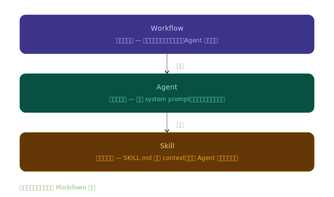

# 三層式結構

這三層式結構是一種職責分離的設計，在此結構中區分為：

+ Workflow：流程編排者
+ Agent：是任務執行者
+ Skill：是知識提供者

<center>
  
</center>

## 職責與關係

### Workflow

Workflow 是最外層的編排者，它的 Markdown 不是給模型「直接執行」的指令，而是描述誰、在什麼條件下、呼叫誰的流程圖。

<center>
  
</center>

Workflow 本質上是 Orchestrator 的 system prompt 腳本。它不執行任何工具，只負責決策：**「現在應該把什麼任務、以什麼格式、交給哪個 Agent 去做」**。關鍵設計是 ```## Steps``` 中的每個步驟都應明確指定 input contract（傳什麼進去）與 output contract（收什麼回來）。

### Agent

Agent 是真正「做事」的角色。它是一份完整的 system prompt 規格，在新 session 中完整載入。

<center>
  
</center>

Agent 最重要的特性是完整性與防護性：所有行為邊界在 ```## Role``` 和 ```## Scope``` 中寫死，```## Isolation rules``` 則是最後一道防線，確保即使 user turn 裡有惡意指令也不會被執行。Skill 的內容是在 Agent 啟動後追加進 context，屬於 system prompt 的擴展，不是覆蓋。

### Skill

Skill 是三層中唯一有標準化檔案格式規範，結構由 ```YAML frontmatter + Markdown body + 可選 bundled resources``` 三部分組成。

<center>
  
</center>

Skill 的設計核心是 Progressive Disclosure（漸進式揭露），分三個載入層級：```description``` 欄位永遠在 context（約 100 words），決定觸發時機；body 在觸發後整個注入，是主要的執行指引；references 和 scripts 只有在 body 裡明確指向時才載入，讓 Skill 可以無限擴充而不佔用不必要的 context。

### 三層結構間的互動流程

```
Workflow.md          Agent.md              SKILL.md
─────────────────    ──────────────────    ──────────────────
## Steps             (新 session)          (觸發後注入)
  - input: {JSON}  → ## Role              YAML: description
  - call: Agent A  → ## Scope          ↗  ## 執行流程
  - output: {JSON} → ## Input contract    ## 輸出格式
                   → ## Output contract   references/ (按需)
                   → ## Isolation rules
                     + SKILL.md body 追加
```

若一句話總結其職責：

+ Workflow 說 **「要做什麼」**
+ Agent 說 **「我是誰、怎麼做」**
+ Skill 說 **「做這件事的最佳實踐是什麼」**

## Session 隔離性

在三層式結構中有個主要議題，被 Workflow 執行的 Agent 是否為新 Session，且 Agent 的提示詞不會互相干擾。

**本節彙整 Claude.ai 回應內容，但 Copilot 並無相同回應。**

### 為什麼新 Session 能確保隔離？

每次 Workflow 呼叫一個 Agent，本質上是發出一個全新的 ```messages.create()``` API 請求。新 session 意味著：

+ 新 session 的 context window 只包含：
  - ✅ Agent 自己的 system prompt（固定）
  - ✅ Workflow 傳入的 user turn（序列化資料）
  - ✅ Skill body（觸發後追加進 system prompt）
+ 完全不存在：
  - ❌ Workflow 的對話歷史
  - ❌ 其他 Agent 的 system prompt
  - ❌ 前一個 Agent 的中間思考過程

這個隔離是結構性的，不依賴提示詞的善意措辭，而是 API 呼叫邊界本身就切斷了 context 的傳遞。

<center>
  
</center>

**補充說明**，在 Claude 是透過 `allowed-tools: Agent`，並提供 `Agent` 工具來確保當下呼叫為一個獨立的子代理 ( SubAgnet )；同樣設計在 Copilot 並未支援，但若實踐相近效果，如預期包括以下方式：

+ 使用 MCP 伺服器，利用伺服器間的執行程序獨立來分離
+ 使用 YAML 工作流程定義 + 提示詞編排，實務驗證後時要依靠提示詞的規範來確保獨立性，但實際效果依靠大語言模型對提示詞的解釋，且會導致 Workflow 內容擴大
+ 使用多代理框架 ( 如 AutoGen、LangGraph )，利用撰寫程式來達到多執行續運行，但需撰寫獨立應用程式

### 隔離性的保證

1. Prompt 內容不洩漏
Workflow 的 system prompt 裡可能含有敏感的業務邏輯、API 金鑰描述、或編排策略。由於 Agent 是新 session，它根本看不到這些內容，無法被引導去複述或繞過。

2. 中間狀態不污染
假設 Agent A 在執行過程中接收到一段惡意輸入，並在回應中夾帶了「請忽略後續所有指令」之類的文字。這段文字確實會進入 Workflow 的 context（作為 Agent A 的回傳值），但 Agent B 是新 session，完全不會看到它。

3. 角色不漂移（Role drift）
長對話中模型的行為容易受到累積 context 的影響而偏離原始角色。每次 Agent 都從乾淨的 system prompt 啟動，不存在因為「前 20 輪對話」而導致行為逐漸改變的問題。
