# 文件操作

大語言模型對於提示詞的文件操作流程如下圖所示：



## 靜態注入：讀取後貼入 context

這是最基本的模式，適合檔案內容已知、不大的場景。

做法：先用程式讀取檔案，再用 XML 標籤包裹後塞入 system prompt 或 user message。

### Python

以下用法實質上是在執行提示詞前，先執行 Python 程式來建構 Prompt 內容，適用於基於 API 的代理人設計。

```
# 讀取檔案
with open("config.yaml") as f:
    content = f.read()

prompt = f"""
<file name="config.yaml">
{content}
</file>

根據上面的設定檔，回答以下問題：...
"""
```

以上用法需注意：

+ 用 <file name="..."> 這類具名標籤，讓 LLM 知道內容的來源邊界
+ 多個檔案時，每個都獨立標籤，避免 LLM 混淆哪段屬於哪個檔案
+ 超過 8k tokens 的檔案要考慮截斷或摘要策略

### 讀檔符號 ***@***

不同大語言模型服務，有一個常見的慣例語法 `@`，此符號用於讀取檔案，且主流大語言模型發工具皆有支援。

#### `@` 符號的本質

`@filename` 不是提示詞語法，而是**工具層的快捷指令**。

背後的流程是：

1. 工具偵測到 `@` 前綴
2. 讀取對應檔案內容
3. 將內容展開後，作為 context 注入 prompt
4. LLM 看到的是展開後的內容，而非 `@` 符號本身

#### 模型支援度

以下為初步調查數個大語言模型對此符號的支援度。

| 工具 | 檔案引用 | 目錄引用 | 全專案搜尋 |
|---|---|---|---|
| Claude Code | `@file.py` | `@src/` | — |
| Gemini | `@file.py` | `@src/` | `@./` |
| Cursor | `@file.py` | `@src/` | `@codebase` |
| Copilot Chat | `#file:file.py` | `#file:src/` | `@workspace` |
| 自建 pipeline | 自訂解析規則 | 自訂解析規則 | 自訂解析規則 |

## 動態搜尋：讓 LLM 自己找檔案（Tool Use）

適合目錄龐大、事先不知道要讀哪些檔案的 agentic 場景，讓大語言模型解讀提示詞後，理解並運行相應的工具來達到動態載入檔案並構築內容。

### Tool Use 的正確執行流程

1. 開發者定義工具清單
   （名稱、說明、參數 schema）
2. 連同 prompt 一起送給 LLM API
3. LLM 判斷：「我需要呼叫 search_files，參數 query='auth logic'」
   → 輸出結構化的工具呼叫請求（JSON 格式）
4. 你的應用程式接收到這個請求
   → 真正執行對應的程式碼（可以是 Linux 指令、Python 函式、HTTP API…任何東西）
5. 把執行結果塞回 prompt，再送給 LLM
6. LLM 根據結果繼續回答

### Tool 的定義

Tool Use 的工具，是開發者自行定義的**函式介面**，背後可以是：

| 背後實作 | 範例 |
|---|---|
| Python 函式 | `def read_file(path): ...` |
| Linux 指令封裝 | 在函式內呼叫 `subprocess.run(["cat", path])` |
| Shell 腳本封裝 | 在函式內執行 `./search.sh keyword` |
| HTTP API 呼叫 | 呼叫 GitHub API、Slack API |
| 資料庫查詢 | 執行 SQL |
| 向量搜尋 | 查詢 embedding 資料庫 |

### Markdown 範本

System Prompt Template

```markdown
## 你的能力

你可以使用以下工具存取本地檔案系統：

| 工具名稱 | 說明 |
|---|---|
| `list_directory(path)` | 列出指定目錄下的所有檔案與子目錄 |
| `read_file(path, max_lines)` | 讀取指定檔案的內容，max_lines 預設 200 |
| `search_files(query, directory)` | 在目錄中搜尋包含關鍵字的檔案 |

## 行為準則

1. **先探索，再閱讀**：收到任務後，先用 `list_directory` 了解結構，再決定讀哪些檔案
2. **按需讀取**：不要一次讀取所有檔案，只讀與任務直接相關的部分
3. **說明依據**：每個結論都要標明來自哪個檔案的哪個部分
4. **遇到大檔案**：使用 `max_lines` 參數限制讀取量，優先讀取開頭與關鍵段落
```

呼叫範例（Few-shot）

```markdown
## 範例對話

**使用者**：請幫我審查這個專案的錯誤處理邏輯。

**助手的正確行為**：
1. 呼叫 `list_directory(".")` → 了解專案結構
2. 呼叫 `read_file("src/error_handler.py")` → 讀取核心檔案
3. 呼叫 `search_files("try except", "src/")` → 找出所有錯誤處理點
4. 根據讀取內容給出具體建議
```

## 結構化引用：用標籤區隔多個知識來源

當需要同時引入多個不同性質的檔案（設定、說明、範例），標籤結構 ( 運用 XML、JSON 描述行為 ) 至關重要；雖然結構化引用本身也是一種靜態注入，僅論運作程序與 `@` 符號相同，但仍有幾個情況下建議使用：

+ 多檔案時的邊界清晰度
+ 中介資料的攜帶能力
+ 注入內容的精確控制
+ 不依賴特定工具的可攜性
+ 大語言模型回答的引用追溯品質

不過，結構化方式在不同大語言模型並不相同，實際設計方式仍需參考對應大語言模型。

實務上，若是偏重引入內容，仍建議使用 `@` 符號，大語言模型服務的工具層會自動填上包裹結構，若要避免多檔案的邊界模糊，則用段落、符號明確切割內容，如下範例：

```markdown
## 角色

你是一個資深程式碼審查工程師。

## 背景資料

- 系統架構：@docs/architecture.md
- 編碼規範：@docs/coding-standard.md
- 目標檔案：@src/auth.py

## 任務

1. 確認 @src/auth.py 是否符合編碼規範
2. 找出與 @docs/architecture.md 描述不一致的地方
3. 給出具體的修改建議

## 輸出格式

用條列方式呈現，每項標明對應的規範來源。
```
